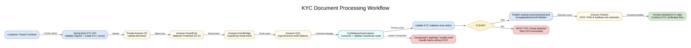
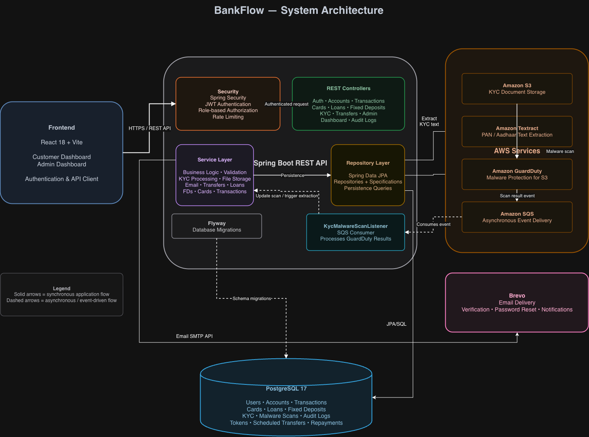
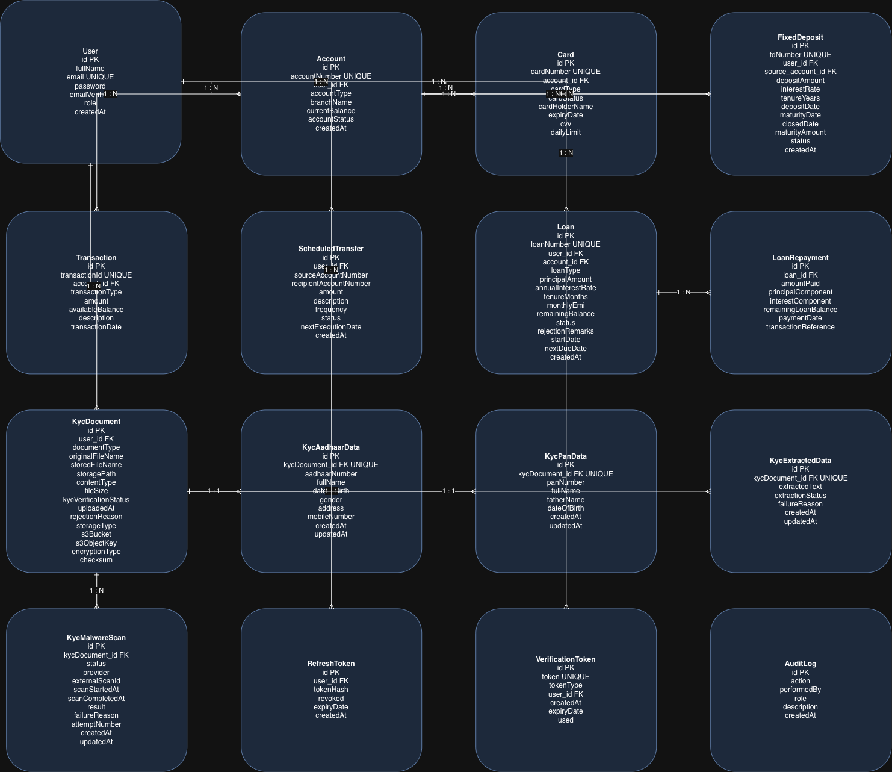
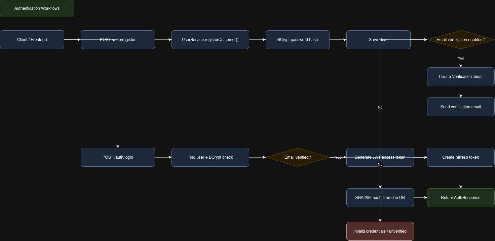
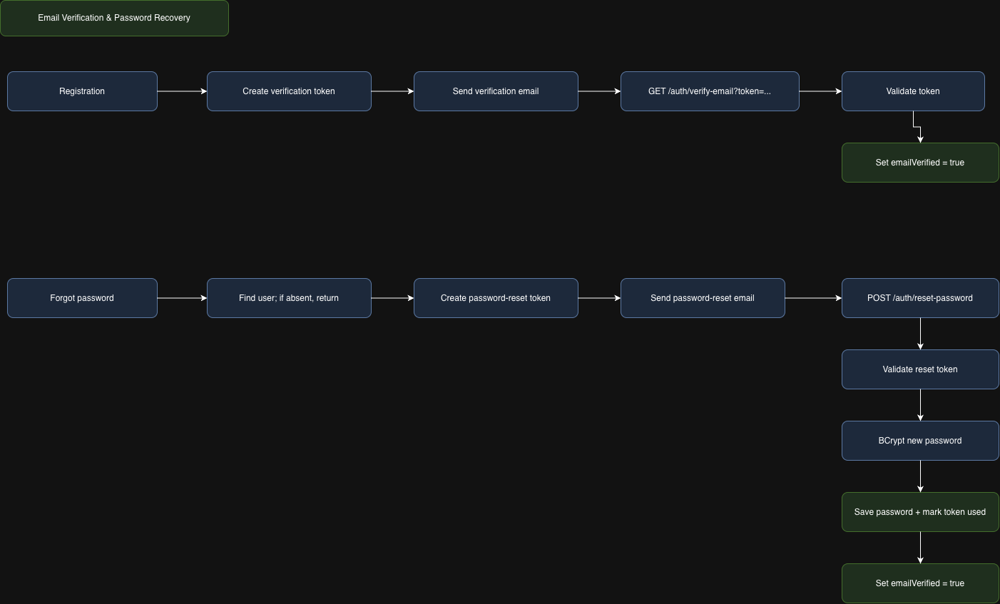
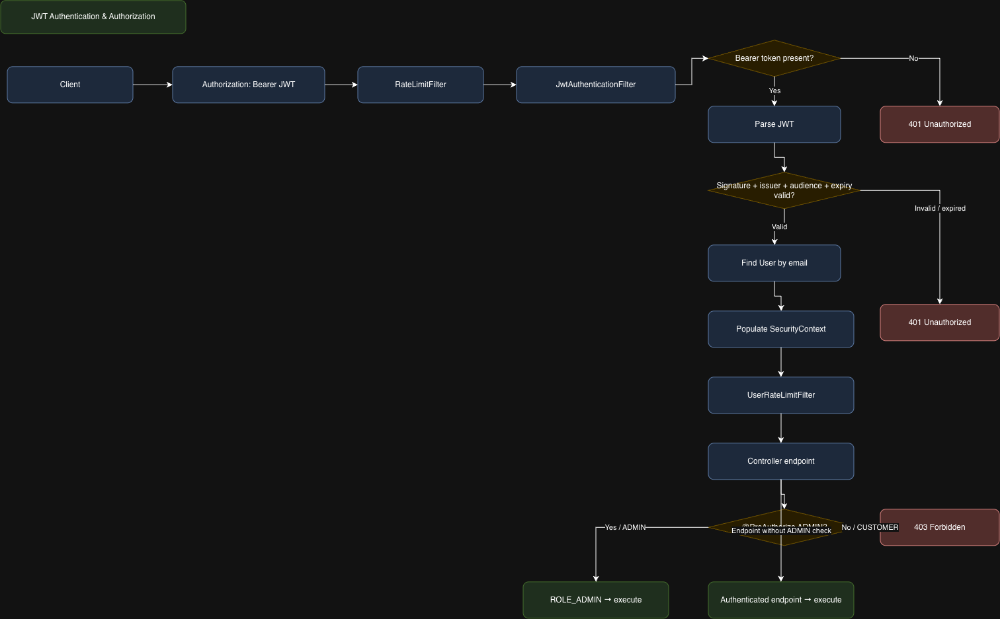
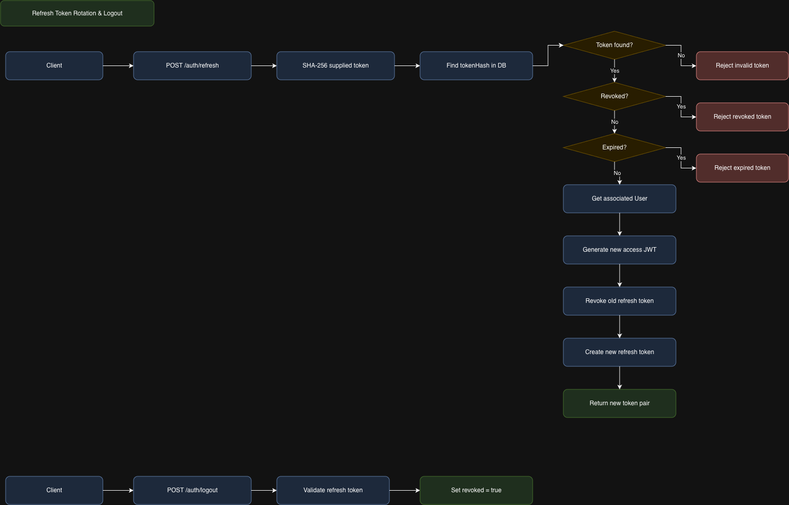
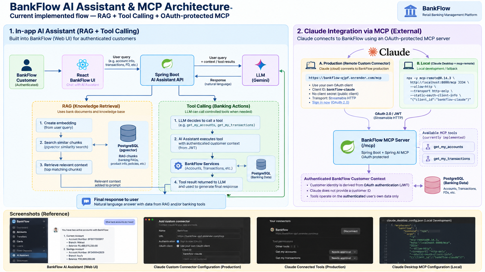
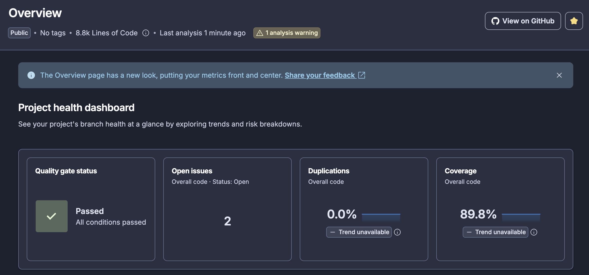

# BankFlow — Retail Banking Management Platform

BankFlow is a full-stack retail banking management application built to demonstrate the design and implementation of a secure, modular banking system.

It provides customer and administrator workflows for account management, transactions, fund transfers, cards, loans, fixed deposits, KYC processing, auditing, and authentication.

The project is built with **React**, **Java 21**, **Spring Boot**, and **PostgreSQL**, with AWS services used for asynchronous KYC document processing.

It also includes an authenticated **AI assistant** (RAG + LLM tool calling) and a remote **Model Context Protocol (MCP) server** that lets **Claude** securely query a customer's banking data after an OAuth login.

> **Portfolio / Learning Project**
>
> BankFlow is an educational and portfolio project and is **not intended for use as production banking software**. Real banking systems require substantially stronger security controls, regulatory compliance, audited infrastructure, fraud detection, operational controls, and resilience mechanisms.

---

## 🌐 Live Demo

| Resource | Link |
| --- | --- |
| Web application | [https://bankflow-ui.onrender.com](https://bankflow-ui.onrender.com/) |
| MCP server (for Claude) | `https://bankflow-qjpf.onrender.com/mcp` |

> **Note:** BankFlow is hosted on Render's free tier, so the first request after a period of inactivity can take up to about a minute while the service wakes up.
>
> New accounts must verify their email address (sent through Brevo) before they can log in.

<!-- TODO: add demo customer credentials here once the pre-verified demo account is created -->

---

## ✨ Features

### 🔐 Authentication & Authorization

- Customer registration and login
- Email verification
- Forgot-password and password-reset workflows
- JWT-based authentication
- Refresh-token based session renewal
- Logout and token invalidation
- Role-based access control
- Customer and administrator access separation
- Customer-owned resource authorization
- Password change
- Rate limiting for selected operations

### 🏦 Banking Accounts

- View customer accounts
- Account details and balances
- Account lifecycle management
- Daily transaction-limit management
- Account freezing and unfreezing
- Administrative account management
- Account transaction history

### 💸 Transactions & Transfers

- Transaction history
- Transaction filtering and searching
- Account-based transaction filtering
- Date-range filtering
- Transaction-type filtering
- Fund transfers between accounts
- Transfer validation
- Scheduled fund transfers
- Scheduled-transfer management

### 💳 Cards

- Customer card management
- View card details
- Card status management
- Administrative card management
- Block and unblock cards

### 💰 Loans

- Loan application
- Loan details and status
- Loan approval/rejection workflows
- Loan repayment / EMI payment
- Administrative loan management

### 📈 Fixed Deposits

- Fixed-deposit calculation
- Open fixed deposits
- View fixed deposits
- Fixed-deposit details and maturity information

### 🪪 KYC Document Processing

BankFlow implements an asynchronous KYC document-processing pipeline using AWS services.

The high-level flow is:

```text
Customer
   │
   ▼
React Frontend
   │
   ▼
Spring Boot KYC API
   │
   ▼
Private Amazon S3
   │
   ▼
Amazon GuardDuty
Malware Protection for S3
   │
   ▼
Amazon EventBridge
   │
   ▼
Amazon SQS
   │
   ▼
KycMalwareScanListener
   │
   ├─────────────── Threat / Invalid ───────────────► Stop processing
   │
   ▼
CLEAN
   │
   ▼
KycExtractionEvent
   │
   ▼
Amazon Textract
   │
   ▼
Extracted KYC Data
```
The malware scan result is processed asynchronously. Clean documents continue to the existing KYC extraction flow, while infected documents are prevented from reaching OCR processing.
The listener also handles unexpected, duplicate, or invalid event scenarios without starting the extraction process.
See the detailed workflow:


### 🤖 AI Assistant (RAG + Tool Calling)

- Authenticated in-app AI assistant available after login
- Retrieval-Augmented Generation (RAG) over the project's documentation (README, OpenAPI specification, architecture and workflow documents)
- Embeddings generated with a Google Gemini embedding model and stored in Neon PostgreSQL alongside the application data
- LLM tool calling for read-only lookups of the logged-in customer's accounts, transactions, and related data
- No state-changing operations (no transfers or updates) are exposed to the assistant

### 🔌 MCP Server for Claude

- Remote MCP server deployed on Render at `https://bankflow-qjpf.onrender.com/mcp`
- OAuth login and consent flow: users sign in with their BankFlow account and authorize access to their profile and email
- Read-only banking tools (accounts, transactions) callable directly from Claude chat
- Streamable HTTP transport, secured with OAuth 2.0 / JWT
- Works with Claude through a remote custom connector, or through Claude Desktop's config file

See [AI Assistant & Claude MCP Integration](#-ai-assistant--claude-mcp-integration) for details and setup steps.

## 🛠️ Technology Stack
### Frontend
- React
- JavaScript
- REST API integration
- React-based customer and administrator dashboards
### Backend
- Java 21
- Spring Boot 3.4.7
- Spring Security
- JWT authentication
- Spring Data JPA
- Hibernate
- Bean Validation
- Spring Data JPA Specifications
- Flyway
- Springdoc OpenAPI
- Spring Boot Actuator
### Database
- PostgreSQL
- Neon PostgreSQL
- Flyway database migrations
### AWS
- Amazon S3
- Amazon GuardDuty Malware Protection for S3
- Amazon EventBridge
- Amazon SQS
- Amazon Textract
### AI / LLM
- Retrieval-Augmented Generation (RAG)
- Google Gemini embedding model
- LLM tool calling
- Model Context Protocol (MCP) server
- OAuth 2.0 / JWT-secured MCP access
- Streamable HTTP MCP transport
### Other Services / Libraries
- Brevo — email delivery
- OpenPDF — PDF generation
- Apache POI — document processing
- Mockito / JUnit — testing
- JaCoCo — test coverage
### Deployment
- Render — frontend, backend, and MCP server hosting
- Neon — PostgreSQL
- AWS — cloud services
- Brevo — email delivery
## 🏗️ Architecture
BankFlow follows a layered backend architecture with a React frontend communicating with Spring Boot REST APIs.
The application integrates PostgreSQL for persistence and external services for email, document storage, malware scanning, asynchronous messaging, and OCR.
### System Architecture


## 🗄️ Data Model
The application's relational data model is documented using an ER diagram covering users, accounts, transactions, cards, loans, fixed deposits, KYC data, scheduled transfers, refresh tokens, verification tokens, and audit information.
### Entity Relationship Diagram


## 🔄 Workflows
The repository contains detailed workflow diagrams for the application's authentication, authorization, session, and KYC processing flows.
### Authentication


### Email Verification & Password Reset


### JWT Authorization


### Refresh Token & Logout


### KYC Document Processing


## 🤖 AI Assistant & Claude MCP Integration

BankFlow includes two AI-related capabilities that share the same read-only backend services and the same authorization rules as the REST APIs.

### AI Assistant (RAG + Tool Calling)

Logged-in customers can use an in-app AI assistant that combines two techniques:

| Technique | Purpose | Example question |
| --- | --- | --- |
| **RAG** (Retrieval-Augmented Generation) | Answers questions about BankFlow itself using retrieved documentation | "How does KYC malware scanning work?" |
| **Tool calling** | Fetches the customer's own data through read-only tools instead of guessing | "Show my last 5 transactions" |

```text
Customer question
      │
      ▼
React Frontend ──► Spring Boot AI endpoint (authenticated)
                         │
        ┌────────────────┴─────────────────┐
        ▼                                  ▼
 Documentation question             Account / transaction question
        │                                  │
        ▼                                  ▼
 Gemini embedding of the question   LLM selects a read-only tool
        │                                  │
        ▼                                  ▼
 Similarity search over document    Tool runs through existing services
 embeddings in Neon PostgreSQL      with customer-ownership checks
        │                                  │
        └────────────────┬─────────────────┘
                         ▼
               LLM composes the answer
```

**Knowledge sources for RAG:** the project README, the OpenAPI specification, and the architecture and workflow documentation.

**Design notes**

- The assistant is only available to authenticated users.
- Tools are **read-only** and scoped to the logged-in customer. Money movement and other state-changing operations are not exposed.
- Embeddings are generated with a Google Gemini embedding model and stored in the same Neon PostgreSQL database as the application tables.
- The assistant's tool access is tied to the authenticated BankFlow customer rather than asking the model to supply an arbitrary customer identifier.

This design separates two concerns:

- **Knowledge retrieval:** information retrieved from the BankFlow knowledge base (RAG)
- **Banking data retrieval:** information obtained through controlled backend tools

### AI Assistant & MCP Architecture



The diagram above shows the currently implemented AI flow: the in-app AI assistant combines RAG and read-only LLM tool calling, while Claude connects to the same customer-scoped banking capabilities through the OAuth-protected MCP server.

### MCP Server for Claude

BankFlow also exposes selected banking capabilities through a remote **Model Context Protocol (MCP)** server, so users can query their own data from Claude.

| Item | Value |
| --- | --- |
| MCP endpoint | `https://bankflow-qjpf.onrender.com/mcp` |
| Hosting | Render (part of the Spring Boot backend) |
| Transport | Streamable HTTP |
| Authorization | OAuth 2.0 / JWT: BankFlow login followed by a consent screen (profile and email) |

**Current MCP tools** (all read-only):

| Tool | Description |
| --- | --- |
| `get_my_accounts` | Retrieves accounts belonging to the authenticated BankFlow customer |
| `get_my_transactions` | Retrieves transactions belonging to the authenticated BankFlow customer, with supported filtering and pagination |

```text
Claude (claude.ai / Claude Desktop)
      │
      │ 1. Add connector / start MCP client
      ▼
BankFlow OAuth login + consent
      │
      │ 2. Access granted for the logged-in customer
      ▼
BankFlow MCP Server  (/mcp, Streamable HTTP, OAuth 2.0 / JWT)
      │
      │ 3. Read-only tool calls
      ▼
BankFlow services (ownership checks) ──► Neon PostgreSQL
```

The important security boundary is that the MCP tools use the **authenticated user context**. The MCP client or model does **not** supply a customer ID to select another customer's data.

> You need a verified BankFlow customer account to sign in. See [Live Demo](#-live-demo).

Claude can connect to the BankFlow MCP server in two ways.

#### Option 1: Remote Custom Connector (Production, claude.ai and Claude Desktop)

This is the simplest approach and needs no local software. The connector was verified against the deployed BankFlow application with live production data: both `get_my_accounts` and `get_my_transactions` were successfully invoked through Claude.

1. Open Claude and go to **Settings → Connectors**.
2. Choose **Add custom connector**.
3. Enter a name (for example `BankFlow`) and the MCP server URL:

   ```text
   https://bankflow-qjpf.onrender.com/mcp
   ```

4. Configure the connector:

- **Authentication:** `Sign in now`
- **OAuth client:** `Use your own OAuth client`
- **OAuth client ID:** `bankflow-claude`
- **OAuth client secret:** leave blank (public client)
- **Transport:** `Streamable HTTP`

5. Click **Add**, then **Connect**.
6. Sign in on the **BankFlow login screen** with your customer account.
7. Review and **authorize** access to your profile and email.
8. After the success message, return to Claude. The BankFlow tools now appear under the connector.
9. Start a normal Claude chat, make sure the BankFlow connector is enabled for the conversation, and ask about your banking data.

The BankFlow OAuth server handles user authentication and authorization before Claude can use the MCP tools.

> Custom connector availability depends on your Claude plan. Check Anthropic's current documentation for plan requirements and exact menu names.

#### Option 2: Claude Desktop Config File (`mcp-remote`)

Claude Desktop can also connect through its config file using the `mcp-remote` bridge, which runs the OAuth flow in your browser using the registered public client `bankflow-claude`.

**Requirements:** Claude Desktop and Node.js (for `npx`).

1. Open Claude Desktop's config file:
- macOS: `~/Library/Application Support/Claude/claude_desktop_config.json`
- Windows: `%APPDATA%\Claude\claude_desktop_config.json`
2. Add the BankFlow server pointing at the deployed endpoint:

   ```json
   {
     "mcpServers": {
       "bankflow": {
         "command": "npx",
         "args": [
           "-y",
           "mcp-remote@0.14.3",
           "https://bankflow-qjpf.onrender.com/mcp",
           "3334",
           "--transport",
           "http-only",
           "--static-oauth-client-info",
           "{\"client_id\":\"bankflow-claude\"}"
         ]
       }
     }
   }
   ```

3. Save the file and **restart Claude Desktop**.
4. A browser window opens for the **BankFlow login and consent** flow. Sign in and authorize access.
5. The BankFlow tools appear in Claude Desktop. Ask about your accounts or transactions in a normal chat.

**Local development variant:** to test against a locally running backend, use the same configuration with the local endpoint and plain HTTP allowed:

```json
{
  "mcpServers": {
    "bankflow": {
      "command": "npx",
      "args": [
        "-y",
        "mcp-remote@0.14.3",
        "http://localhost:8080/mcp",
        "3334",
        "--allow-http",
        "--transport",
        "http-only",
        "--static-oauth-client-info",
        "{\"client_id\":\"bankflow-claude\"}"
      ]
    }
  }
}
```

The `--allow-http` flag is for local development only and should not be used with the deployed endpoint.

### MCP Authentication Configuration

The MCP/OAuth deployment requires server-side OAuth configuration, provided through environment variables. **Do not commit OAuth keys or other secrets to the repository.**

```text
OAUTH2_ISSUER
BANKFLOW_OAUTH_JWK
```

The registered public OAuth client used by the Claude integration is `bankflow-claude`. The MCP server and OAuth endpoints are part of the Spring Boot backend.

### Example Prompts

- "Show me all my BankFlow accounts and their balances."
- "List my last 5 transactions."
- "How much did I spend last month?" *(answered from your transaction data)*

### Notes and Troubleshooting

- **Cold start:** the first call after inactivity can take up to about a minute on Render's free tier. If the connection times out, wait a moment and retry.
- **Email verification:** accounts must be verified before they can sign in to BankFlow, including through the OAuth flow.
- **Disconnecting:** remove the connector in Claude's **Settings → Connectors** (Option 1) or delete the `bankflow` entry from the config file and restart Claude Desktop (Option 2).
- **Read-only:** the MCP tools cannot move money, change account settings, or modify data.

## 📖 API Documentation
BankFlow exposes REST APIs documented using OpenAPI.
### OpenAPI Specification
- [OpenAPI YAML](docs/api/bankflow_openapi.yml)
- [OpenAPI JSON](docs/api/bankflow_openapi.json)
  The OpenAPI specification provides the API contract for the backend endpoints, request/response models, and security configuration.
### Swagger UI
When running the backend locally, Swagger UI is available at:
`http://localhost:8080/swagger-ui/index.html`
## 🖥️ Application Screenshots
The repository contains representative screenshots of both customer and administrator functionality.
### Customer

| Feature | Screenshot |
| --- | --- |
| Login | [Login](docs/screenshots/customer/login.png) |
| Dashboard | [Dashboard](docs/screenshots/customer/dashboard.png) |
| Accounts | [Accounts](docs/screenshots/customer/accounts.png) |
| Transactions | [Transaction History](docs/screenshots/customer/transaction_history.png) |
| Cards | [Cards](docs/screenshots/customer/cards.png) |
| Loans | [Loans](docs/screenshots/customer/view_all_loans.png) |
| KYC | [KYC Upload](docs/screenshots/customer/upload_kyc.png) |

### Administrator

| Feature | Screenshot |
| --- | --- |
| Dashboard | [Dashboard](docs/screenshots/admin/dashboard.png) |
| User Management | [User Management](docs/screenshots/admin/user_management.png) |
| Account Management | [Account Management](docs/screenshots/admin/accounts_management.png) |
| Card Management | [Card Management](docs/screenshots/admin/cards_management.png) |
| Loan Approvals | [Loan Approvals](docs/screenshots/admin/loan_approvals.png) |
| KYC Verification | [KYC Verification](docs/screenshots/admin/kyc_verification.png) |
| Audit Logs | [Audit Logs](docs/screenshots/admin/audit_logs.png) |

## 🧪 Testing
The backend contains unit tests covering the application's important business logic and service-layer components.
Testing uses:
- JUnit
- Mockito
- Spring testing utilities where required
- JaCoCo for code coverage reporting
  The focus of testing is on meaningful application behavior, including business rules, validation, authorization-related logic, and service interactions.

## 🔎 SonarQube Cloud — Code Quality Analysis

BankFlow's backend is analyzed with [SonarQube Cloud](https://sonarcloud.io/) to continuously assess code quality, security-related findings, test coverage, and code duplication.

### SonarQube Cloud Setup

1. Create or sign in to a SonarQube Cloud account.
2. Create/import the BankFlow backend project and connect it to the GitHub repository.
3. Note the project's **Project Key** and the organization's **Organization Key**.
4. Generate a SonarQube Cloud analysis token with permission to analyze the project.
5. Configure the following environment variables locally or in the CI environment:

```text
SONAR_PROJECT_KEY
SONAR_ORGANIZATION_KEY
SONAR_TOKEN
```

> **Security:** Never commit `SONAR_TOKEN` or any other SonarQube credentials to the repository.

### Manual Maven Analysis

BankFlow uses Maven-based Sonar analysis for the Spring Boot backend. When using Maven/manual analysis, **Automatic Analysis must be disabled** for the SonarQube Cloud project to avoid running both analysis methods.

From the `backend/` directory, run:

```bash
mvn clean verify org.sonarsource.scanner.maven:sonar-maven-plugin:sonar \
  -Dsonar.projectKey="$SONAR_PROJECT_KEY" \
  -Dsonar.organization="$SONAR_ORGANIZATION_KEY" \
  -Dsonar.token="$SONAR_TOKEN"
```

The command first builds and verifies the backend and then uploads the SonarQube analysis results to the configured SonarQube Cloud project.

### Analysis Results

The SonarQube Cloud dashboard provides an overview of the analyzed backend, including the quality gate, open issues, code duplication, and test coverage.



The captured project analysis demonstrates:

- **Quality Gate:** Passed — all configured quality-gate conditions passed.
- **Open Issues:** 2
- **Code Duplication:** 0.0%
- **Test Coverage:** 89.8%
- **Lines of Code:** 8.8k
- **Analysis Warning:** 1

This screenshot serves as evidence of the SonarQube Cloud analysis for the **BankFlow backend project**. The frontend is analyzed separately and may have different quality metrics.

---

## 🔐 Security
Security-related functionality implemented in BankFlow includes:
- Spring Security
- JWT authentication
- Refresh-token workflow
- Role-based authorization
- Customer resource ownership checks
- Password hashing
- Email verification
- Password-reset tokens
- Rate limiting
- Audit logging
- Private S3 KYC document storage
- Asynchronous malware scanning before OCR processing
- Malware result handling through AWS event-driven processing
- OAuth login and consent flow for MCP clients
- Read-only, customer-scoped tools for the AI assistant and MCP server
- Authenticated-only access to the AI assistant
## 📂 Project Structure

```text
BankFlow/
├── frontend/
│   └── React application
│
├── backend/
│   └── Spring Boot application
│
├── docs/
│   ├── architecture/
│   │   ├── bankflow-system-architecture.drawio.png
│   │   └── bankflow-system-architecture.drawio.xml
│   │
│   ├── data-model/
│   │   ├── bankflow-erd.drawio.png
│   │   └── bankflow-erd.drawio.xml
│   │
│   ├── workflows/
│   │   ├── BankFlow_Authentication_Workflows.drawio.png
│   │   ├── BankFlow_Authentication_Workflows.drawio.xml
│   │   ├── BankFlow_Email_Password_Workflows.drawio.png
│   │   ├── BankFlow_Email_Password_Workflows.drawio.xml
│   │   ├── BankFlow_JWT_Authorization_Workflow.drawio.png
│   │   ├── BankFlow_JWT_Authorization_Workflow.drawio.xml
│   │   ├── BankFlow_KYC_Workflow.drawio.png
│   │   ├── BankFlow_KYC_Workflow.drawio.xml
│   │   ├── BankFlow_Refresh_Logout_Workflow.drawio.png
│   │   └── BankFlow_Refresh_Logout_Workflow.drawio.xml
│   │
│   ├── ai/
│   │   └── BankFlow_AI_Assistant_MCP.png
│
│   ├── api/
│   │   ├── bankflow_openapi.yml
│   │   └── bankflow_openapi.json
│   │
│   ├── screenshots/
│   │   ├── customer/
│   │   └── admin/
│   │
│   └── quality/
│       └── sonarqube_cloud_bankflow_project.png
│
└── README.md
```

## 🚀 Running Locally
### Backend
##### Requirements
- Java 21
- Maven
- PostgreSQL or a configured PostgreSQL-compatible database
- Required AWS configuration
- Required Brevo configuration
  Configure the required environment variables/application properties before starting the application.
  Start the Spring Boot backend with:

```bash
./mvnw spring-boot:run
```

Or, if Maven is installed globally:

```bash
mvn spring-boot:run
```
The backend runs by default on:
http://localhost:8080
### Swagger UI
Once the backend is running:
`http://localhost:8080/swagger-ui/index.html`
### Frontend
##### Requirements
- Node.js
- npm
  Install dependencies:

```bash
npm install
```

Start the development server:

```bash
npm start
```
Configure the frontend API base URL to point to the running backend.
## 🐳 Docker Setup

BankFlow can be run locally using Docker Compose in two different ways.

### Prerequisites

Make sure the following are installed:

- Docker Desktop
- Git

Clone the repository and navigate to the project directory:

```bash
git clone https://github.com/CSMahajan/BankFlow.git
cd BankFlow
```

---

### Option 1: Build and Run BankFlow Locally

This option builds the BankFlow backend and frontend Docker images locally.

The configuration is provided in:

```text
docker-compose.yml
```

#### Start the application

From the project root:

```bash
docker compose up --build
```

This starts:

- PostgreSQL
- ClamAV
- Spring Boot backend
- React frontend

The services communicate with each other through the Docker Compose network.

#### Access the application

Frontend:

```text
http://localhost:5173
```

Backend:

```text
http://localhost:8080
```

Swagger UI:

```text
http://localhost:8080/swagger-ui/index.html
```

#### Stop the application

```bash
docker compose down
```

To stop the containers and also remove the PostgreSQL volume:

```bash
docker compose down -v
```

> Removing the volume deletes the local PostgreSQL data stored by Docker.

---

### Option 2: Run Using Pre-built Docker Images

This option uses pre-built BankFlow images instead of building the backend and frontend locally.

The configuration is provided in:

```text
docker-compose.images.yml
```

The backend and frontend images are pulled from Docker Hub, while PostgreSQL and ClamAV use their respective container images.

#### Start the application

From the project root:

```bash
docker compose -f docker-compose.images.yml up
```

To run the containers in detached mode:

```bash
docker compose -f docker-compose.images.yml up -d
```

#### Access the application

Frontend:

```text
http://localhost:5173
```

Backend:

```text
http://localhost:8080
```

Swagger UI:

```text
http://localhost:8080/swagger-ui/index.html
```

#### Stop the application

```bash
docker compose -f docker-compose.images.yml down
```

To also remove the PostgreSQL volume:

```bash
docker compose -f docker-compose.images.yml down -v
```

> The image-based Compose file contains placeholder values for environment variables such as the Brevo API key, mail sender, AWS S3 bucket, and super-admin password. Configure these values before running the setup. Never commit real credentials or API keys to the repository.

---

### Docker Compose Files

| File | Purpose |
| --- | --- |
| `docker-compose.yml` | Builds the BankFlow backend and frontend images locally |
| `docker-compose.images.yml` | Runs BankFlow using pre-built backend and frontend Docker images |

### Service Architecture

Both configurations run the application using the following services:

```text
                    ┌─────────────────┐
                    │ React Frontend  │
                    │     :5173       │
                    └────────┬────────┘
                             │
                             ▼
                    ┌─────────────────┐
                    │ Spring Boot API │
                    │     :8080       │
                    └───────┬─────────┘
                            │
                  ┌─────────┴─────────┐
                  ▼                   ▼
          ┌──────────────┐    ┌──────────────┐
          │  PostgreSQL  │    │    ClamAV    │
          │     :5432    │    │    :3310     │
          └──────────────┘    └──────────────┘
```

The local Docker setup uses PostgreSQL and ClamAV containers. Production deployment uses the externally hosted infrastructure described in the [Deployment](#️-deployment) section.

## ☁️ Deployment

BankFlow is deployed using Render, Neon, AWS, and Brevo.

### Deployment Architecture

```text
React Frontend
      │
      ▼
    Render
      │
      │ REST API
      ▼
Spring Boot Backend
      │
      ├──► Neon PostgreSQL
      ├──► AWS S3
      ├──► AWS GuardDuty
      ├──► AWS EventBridge
      ├──► AWS SQS
      ├──► AWS Textract
      ├──► Brevo
      └──► Google Gemini API (embeddings)

Claude (claude.ai / Claude Desktop)
      │
      │ OAuth 2.0 / JWT + MCP (Streamable HTTP)
      ▼
Spring Boot Backend (/mcp)
      │
      ▼
Authenticated BankFlow Customer
      │
      ├──► get_my_accounts
      └──► get_my_transactions
```

The deployed application can be accessed through the project's configured Render deployment. The MCP server is served by the same Spring Boot backend at `/mcp`.

## 📚 Documentation

| Documentation | Description |
| --- | --- |
| [System Architecture](docs/architecture/bankflow-system-architecture.drawio.png) | Application and infrastructure architecture |
| [ERD](docs/data-model/bankflow-erd.drawio.png) | Database relationships and entities |
| [Authentication Workflow](docs/workflows/BankFlow_Authentication_Workflows.drawio.png) | Authentication flow |
| [Email & Password Workflow](docs/workflows/BankFlow_Email_Password_Workflows.drawio.png) | Email verification and password reset |
| [JWT Authorization Workflow](docs/workflows/BankFlow_JWT_Authorization_Workflow.drawio.png) | JWT authorization flow |
| [Refresh & Logout Workflow](docs/workflows/BankFlow_Refresh_Logout_Workflow.drawio.png) | Refresh-token and logout flow |
| [KYC Workflow](docs/workflows/BankFlow_KYC_Workflow.drawio.png) | Asynchronous KYC malware scanning and extraction |
| [OpenAPI YAML](docs/api/bankflow_openapi.yml) | API specification |
| [OpenAPI JSON](docs/api/bankflow_openapi.json) | API specification in JSON format |
| [AI Assistant & Claude MCP Integration](#-ai-assistant--claude-mcp-integration) | RAG, tool calling, MCP architecture, and Claude integration |
| [AI Assistant & MCP Architecture](docs/ai/BankFlow_AI_Assistant_MCP.png) | RAG, tool calling, OAuth-protected MCP, and Claude integration architecture |
| [SonarQube Cloud Analysis](docs/quality/sonarqube_cloud_bankflow_project.png) | Code quality, coverage, duplication, and quality-gate evidence |

## ⚠️ Disclaimer
BankFlow is a portfolio and learning project intended to demonstrate full-stack development, backend architecture, security concepts, database design, testing, and cloud integration.
It should not be used for handling real banking operations or sensitive financial information.
The AI assistant and MCP server are read-only demonstrations. Their answers are generated by a language model and may be incomplete or inaccurate, and they are not financial advice.
A production banking platform would require additional controls such as:
- Regulatory compliance
- Independent security audits
- Enterprise-grade key management
- Hardware-backed security controls
- Advanced fraud detection
- Transaction monitoring
- High-availability and disaster-recovery architecture
- Comprehensive observability
- Stronger operational controls
- Formal threat modeling and penetration testing
- Industry-specific compliance requirements
## 👨‍💻 Project
BankFlow — Retail Banking Management Platform
Built as a full-stack engineering project to explore secure REST API design, banking-domain workflows, asynchronous cloud processing, retrieval-augmented generation, LLM tool calling, MCP integration, database design, testing, and deployment.
