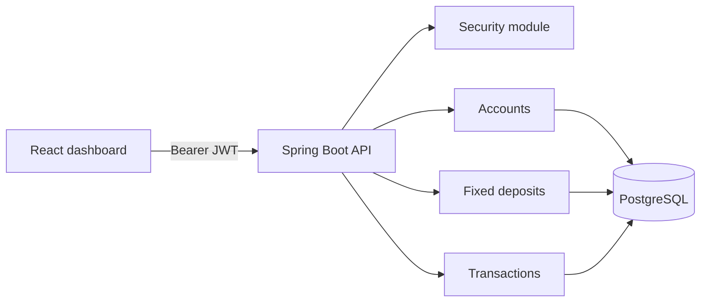

# Architecture notes

The API follows a modular monolith design: `auth`, `account`, `deposit`, and `transaction` each own their controller, service, DTOs, and persistence model. This is deliberately easier to explain in an interview than a microservice split with no operational reason.

### Ownership rule

All customer-facing lookups must constrain results by the authenticated user ID. An `ADMIN` is allowed broader access; a `CUSTOMER` is not. Keep this authorization check in services, not just the UI.

### Fixed-deposit formula

For the learning project, maturity uses annual compounding:

`maturity = principal × (1 + annualRate / 100) ^ tenureYears`

The deposit must exceed ₹10,000 and tenure must be 1, 3, or 5 years.
